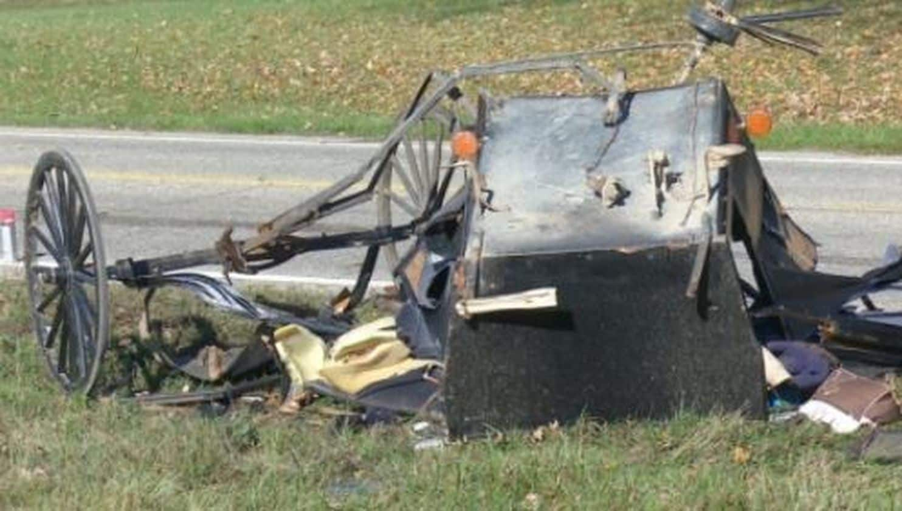

# Starkfield 

Welcome to the official Starkfield NEWS page.

 

## Stories

* > ### **Carriage Crash into Elm Tree**.  
  > Last tuesday night, December 3, a couple crashed into an overgrown elm tree in their carriage.  
  > Reports say that the crash resulted in fatal injuries to the couple.  
  >   
  > The couple's families have spoken out, requesting that everyone is careful when riding their carriages through the storm season.  
  > There is no word from the city council, who has been expected to improve road saftey for the past several months leading into the winter season.  
  
 

* > ### **Glue Shortages Cause Panic**  
  > A recent shortage of glue and other adhesive products in local stores causes panic.  
  > Shop owners claim that the shortage is caused by decreased imports due to recent storms making transportation costs skyrocket.  
  >   
  > "I just dont know where to get more bottles to stock the stores," says a local shopkeep, "the prices for shipping em' in is just too high, and I sure aren't getting them myself with this weather."  
  
 

* > ### **Local Woman Diagnosed with Terminal Disease**  
  > Last Wedsnesday, December 18, Starkfield NewsTM was informed about the unfortunate condition that housewife Zenobia Frome has been diagnosed with after a recent doctor visit.  
  > Zenobia has made a statement on the matter, herself:  
  > > "I went to the doctor in Bettsbridge to consult about my condition. I was expecting him to give me a new medication,                and that I would be on my way, but apperently things have gotten much worse. The doctor informed me that I have developed 'complications' that would not be teatable"  
  > That is all that Mrs. Frome has chosen to share with Starkfield NewsTM. She is planning to hire a houseworker to do work for her around the house so she can rest for her last few months.  
  > The enire Starkfield NewsTM team sends our warm regards to the Frome family.  

### About us

We are a non profit orginazation devoted to delivering the town of Starkfield, Massachussets the highest wuality and most relavant news in the town. For more information about our program, please review our main website (insert some troll link).

For more details see [GitHub Flavored Markdown](https://guides.github.com/features/mastering-markdown/).

### Jekyll Themes

Your Pages site will use the layout and styles from the Jekyll theme you have selected in your [repository settings](https://github.com/Weinstein-Classics/Ethan-Frome/settings). The name of this theme is saved in the Jekyll `_config.yml` configuration file.

### Support or Contact

Having trouble with Pages? Check out our [documentation](https://help.github.com/categories/github-pages-basics/) or [contact support](https://github.com/contact) and we’ll help you sort it out.
