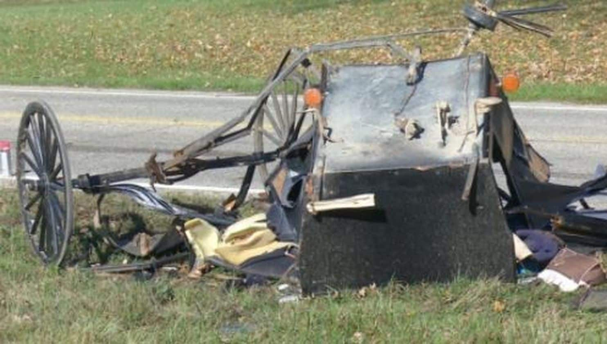
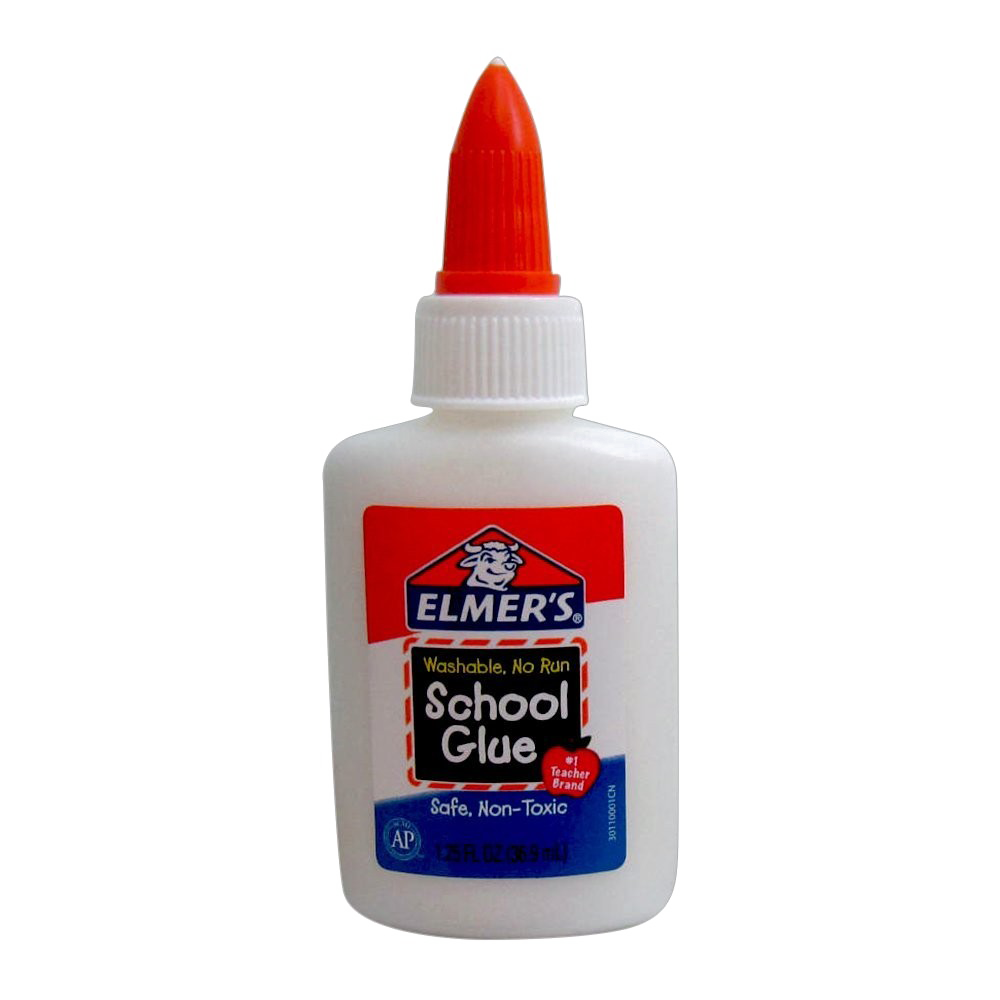

<!--# Starkfield ™

Welcome to the official Starkfield NEWS page.

---
-->

## Stories

- > ### **Carriage Crash into Elm Tree**
  >
  >   
  > Last tuesday night, December 3, a couple crashed into an overgrown elm tree in their carriage.  
  > Reports say that the crash resulted in fatal injuries to the couple.  
  > The couple's families have spoken out, requesting that everyone is careful when riding their carriages through the storm season.  
  > There is no word from the city council, who has been expected to improve road saftey for the past several months leading into the winter season.

- > ### **Glue Shortages Cause Panic**
  >
  >   
  > A recent shortage of glue and other adhesive products in local stores causes panic.  
  > Shop owners claim that the shortage is caused by decreased imports due to recent storms making transportation costs skyrocket.  
  > "I just dont know where to get more bottles to stock the stores," says a local shopkeep, "the prices for shipping em' in is just too high, and I sure aren't getting them myself with this weather."

- > ### **Local Woman Diagnosed with Terminal Disease**
  >
  > 
  > Last Wedsnesday, December 18, Starkfield News™ was informed about the unfortunate condition that housewife Zenobia Frome has been diagnosed with after a recent doctor visit.  
  > Zenobia has made a statement on the matter, herself:
  > > "I went to the doctor in Bettsbridge to consult about my condition. I was expecting him to give me a new medication,                and that I would be on my way, but apperently things have gotten much worse. The doctor informed me that I have developed 'complications' that would not be teatable"
  >
  > That is all that Mrs. Frome has chosen to share with Starkfield News™.  
  > She is planning to hire a houseworker to do work for her around the house so she can rest for her last few months.  
  > The enire Starkfield News™ team sends our warm regards to the Frome family.

- > ### **Another Couple Crashes into Elm Tree**
  >
  > Last Thursday, another couple crashed into the big elm tree on the side of the road near the highway.
  > The couple has been identified as Ethan Frome and Mattie Silver, residents of the Frome household.
  > The couple survived the crash, but suffered from severe injuries and several fractured bones.
  > Ethan's wife, Zeena, is now planning to care for the injured, despite her own ailments.
  > The Starkfield City Council has made an official statement regarding the low visibility in the storm season. The link to that article can be found here <a >Link Here</a>
  > Be careful out there, Starkfield!

### About us

We are a non profit orginazation devoted to delivering the town of Starkfield, Massachussets the highest quality and most relavant news in the town. For more information about our program, please review [our parent company](https://www.youtube.com/watch?v=dQw4w9WgXcQ)
